```mermaid
flowchart TD
    A(["🗣️ Patient Input\nnatural language · city · age · comorbidities · budget"])

    A --> S1

    subgraph S1["🧠 Stage 1 · Semantic Clinical Mapper"]
        direction TB
        B1["Encode query\nall-MiniLM-L6-v2"]
        B2["Cosine similarity match\nclinical_mapping.csv"]
        B3["Returns: condition · procedure\nspeciality · confidence score"]
        B1 --> B2 --> B3
    end

    S1 --> S2

    subgraph S2["🏥 Stage 2 · Provider Discovery & Ranking"]
        direction TB
        C1["Filter by city + speciality\nhospital_filter.py"]
        C2["Score: Rating 30% · Affordability 25%\nReview 25% · Base 20%"]
        C3["Aggregate reviews\nreviews.csv → review_utils.py"]
        C1 --> C2
        C3 --> C2
    end

    S2 --> S3

    subgraph S3["💸 Stage 3 · Cost Estimation Engine"]
        direction TB
        D1["Procedure base range\nprocedure_costs.json"]
        D2["Diagnostic costs\ndiagnostic_costs.json"]
        D3["Apply multipliers\ncost_config.json · age · comorbidities"]
        D4["Fetch top doctors\ndoctor_mapper.py"]
        D1 --> D3
        D2 --> D3
        D4 --> D3
    end

    S3 --> S4

    subgraph S4["✨ Stage 4 · LLM Explanation"]
        direction TB
        E1["Build prompt\nprompt_structure.txt"]
        E2["Gemini 2.5 Flash\nstreamed token-by-token"]
        E1 --> E2
    end

    S4 --> OUT

    OUT(["✅ Output\nRanked hospitals · Cost breakdown\nTop doctors · Confidence score · AI rationale"])

    style A fill:#1a3a3a,stroke:#4f98a3,color:#ccc
    style OUT fill:#1a3a1a,stroke:#6daa45,color:#ccc
    style S1 fill:#0d2020,stroke:#4f98a3
    style S2 fill:#201a00,stroke:#e8af34
    style S3 fill:#201000,stroke:#fdab43
    style S4 fill:#1a0d2e,stroke:#a86fdf
```

<div align="center">

# 🏥 Arogya
### *Clear Paths. Real Costs. Better Care.*

**An AI-powered decision intelligence platform that translates patient intent into clinical pathways, ranked providers, and transparent cost estimates — built for Bharat.**

<br/>

[](https://unstop.com/competitions/crp-tenzorx-2026-national-ai-hackathon-poonawalla-fincorp-1651867)
[]()
[](https://python.org)
[](https://streamlit.io)
[](LICENSE)

<br/>

> *"We didn't build a chatbot. We built a structured intelligence layer that maps*
> *symptoms → conditions → providers → costs — with confidence scores you can trust."*

<br/>

**[🚀 Live Demo](#) · [📽️ Pitch Video](#) · [📊 Presentation](#)**

</div>

---

## 🎯 The Problem We're Solving

India has **1.4 billion people** and some of the most opaque healthcare pricing in the world.

A patient in **Nagpur, Patna, or Indore** facing a knee replacement or a cardiac event is left with three brutal unknowns — and no reliable way to resolve them:

| ❌ Without Arogya | ✅ With Arogya |
|---|---|
| "Which hospital should I go to?" | Ranked providers by capability, cost & distance |
| "How much will this cost me?" | Itemized cost ranges with confidence scores |
| "Can I even afford this?" | Financial implications mapped to clinical pathways |
| "Am I choosing the right treatment?" | Standardized clinical mapping via semantic embeddings |

This problem hits hardest in **Tier 2 and Tier 3 cities**, where access to reliable medical information is lowest and the risk of financial ruin from healthcare is highest.

For **lenders and insurers** like Poonawalla Fincorp, the opacity creates a parallel problem — it's nearly impossible to confidently pre-approve healthcare loans without predictable cost data. Arogya provides exactly that missing transparency layer.

---

## 🧠 How It Actually Works

Arogya is not a search engine with a chat wrapper. It's a **4-stage decision intelligence pipeline**:

```
Patient Input  →  Clinical Mapping  →  Provider Ranking  →  Cost Estimation  →  Confident Output
 (natural lang)    (embedding match)    (multi-signal)      (component-level)    (with caveats)
```

```
Patient Input (natural language)
       │
       ▼
 ┌─────────────────────────────────────────┐
 │  Stage 1 · Semantic Clinical Mapper     │
 │  Symptoms → best-match condition via    │
 │  sentence-transformers (MiniLM-L6-v2)   │
 │  + cosine similarity over clinical CSV  │
 └──────────────────┬──────────────────────┘
                    │
                    ▼
 ┌─────────────────────────────────────────┐
 │  Stage 2 · Provider Discovery Engine    │
 │  Location + speciality → ranked list    │
 │  Scoring: rating, affordability,        │
 │  review score, and a base signal        │
 └──────────────────┬──────────────────────┘
                    │
                    ▼
 ┌─────────────────────────────────────────┐
 │  Stage 3 · Cost Estimation Engine       │
 │  Procedure + hospital type + age +      │
 │  comorbidities → itemized cost ranges   │
 │  Powered by diagnostic_costs.json,      │
 │  procedure_costs.json & cost_config.json│
 └──────────────────┬──────────────────────┘
                    │
                    ▼
 ┌─────────────────────────────────────────┐
 │  Stage 4 · LLM-Powered Explanation      │
 │  Gemini 2.5 Flash streams a natural     │
 │  language "why recommended" rationale   │
 │  for the top 3 hospital results         │
 └─────────────────────────────────────────┘
```



---

## ✨ Core Features

### 🗣️ Natural Language Understanding
Query the system exactly the way a real patient would speak:
- *"chest pain while climbing stairs"*
- *"best cancer hospital near Nagpur under ₹5 lakh"*
- *"knee replacement surgery cost in Patna"*
- *"angioplasty doctor, diabetic patient, 58 years old"*

The system uses **`sentence-transformers` (`all-MiniLM-L6-v2`)** to encode the query and find the closest match in `clinical_mapping.csv` via cosine similarity — no rigid keyword rules, no medical knowledge required from the user.

---

### 🏥 Transparent Provider Ranking

Every hospital recommendation is scored across **four explicit, auditable signals**. No black-box suggestions.

| Signal | Weight | What It Measures |
|---|---|---|
| ⭐ **Rating Score** | 30% | Normalized hospital star rating (out of 5) |
| 💰 **Affordability Score** | 25% | Inverse of hospital `cost_index` |
| 🗣️ **Review Score** | 25% | Aggregated patient review score from `reviews.csv` |
| 📊 **Base Signal** | 20% | Fixed baseline score (0.5) |

---

### 💸 Component-Level Cost Estimation

We don't give you a single number. We give you a **breakdown you can actually plan around**:

```
Condition : Coronary Artery Disease
Procedure : Angioplasty (PTCA)

🏥  ABC Heart Institute, Nagpur
    Rating: 4.5 ★  |  NABH Accredited  |  Mid-Tier

    Cost Breakdown
    ├── Procedure / Surgery           ₹ 1,20,000  –  ₹ 2,00,000
    ├── Diagnostics (pre & post-op)   ₹    10,000  –  ₹    20,000
    └── Medications & Consumables     ₹    15,000  –  ₹    30,000
                                      ──────────────────────────
    Total Estimated Range             ₹ 1,45,000  –  ₹ 2,50,000

    Confidence Score: 0.68 / 1.00

    ⚠  This is a decision-support tool. Not a medical diagnosis.
```

Costs are sourced from `procedure_costs.json`, `diagnostic_costs.json`, and adjusted via multipliers in `cost_config.json` based on hospital type, age, and comorbidities.

---

### 🔀 Multi-Source Intelligence Fusion

| Data File | Type | Role in System |
|---|---|---|
| `hospitals.csv` | Structured | Hospital base data (city, speciality, rating, type, NABH, lat/lon) |
| `doctors.csv` | Structured | Doctor profiles linked to hospitals by `hospital_id` |
| `reviews.csv` | Unstructured | Patient reviews used for NLP reputation scoring |
| `clinical_mapping.csv` | Derived | Symptom → condition → procedure → speciality mappings |
| `procedure_costs.json` | Derived | Procedure cost ranges by hospital type |
| `diagnostic_costs.json` | Derived | Diagnostic test cost ranges |
| `cost_config.json` | Config | Age & comorbidity multipliers, hospital type modifiers |

---

## 🛡️ Responsible AI — Built In, Not Bolted On

We treated ethical guardrails as a first-class feature, not an afterthought.

- 🚫 **No diagnosis, ever.** Arogya is a decision-support tool, not a substitute for a doctor.
- 📊 **Confidence scores** on every output — cosine similarity score from the embedding match is always surfaced.
- 📋 **Explicit disclaimers** accompany every cost estimate and provider recommendation.
- 🎲 **Probabilistic mapping** — users are told symptom-to-condition mapping is probabilistic, not deterministic.
- 📉 **Ranges, not false precision** — high pricing variance is surfaced as a range, never collapsed to a misleading single figure.

---

## 🗂️ Project Structure

```
tenzorX/
│
├── 📄 app.py                        # Main Streamlit application entry point
│
├── 📁 modules/
│   ├── __init__.py
│   ├── loader.py                    # Loads all data files into memory
│   ├── embedding_mapper.py          # Sentence-transformer index + cosine similarity matcher
│   ├── mapper.py                    # Query-to-condition mapping (legacy helper)
│   ├── location.py                  # City/pincode resolver
│   ├── hospital_filter.py           # Filters hospitals by city + speciality
│   ├── ranking.py                   # Multi-signal hospital scoring & sorting
│   ├── cost_engine.py               # Component-level cost range generator
│   ├── doctor_mapper.py             # Doctor lookup by hospital_id
│   ├── review_utils.py              # Aggregates review scores per hospital
│   ├── confidence.py                # Confidence score utilities
│   └── llm_explainer.py             # Gemini 2.5 Flash streaming explanation
│
├── 📁 data/
│   ├── hospitals.csv                # Hospital directory (city, speciality, rating, type, lat/lon)
│   ├── doctors.csv                  # Doctor profiles linked by hospital_id
│   ├── reviews.csv                  # Patient reviews per hospital
│   ├── clinical_mapping.csv         # Symptom → condition → procedure → speciality
│   ├── procedure_costs.json         # Procedure cost ranges by hospital type
│   ├── diagnostic_costs.json        # Diagnostic test cost ranges
│   └── cost_config.json             # Age/comorbidity multipliers & type modifiers
│
├── 📄 prompt_structure.txt          # Gemini prompt template for LLM explanations
├── 📄 requirements.txt
└── 📄 README.md
```

---

## 🚀 Getting Started

### Prerequisites
- Python 3.10+
- pip
- A valid **Gemini API key** (set in a `.env` file)

### Installation

```bash
# Clone the repository
git clone https://github.com/TheyCallMeAnirban/tenzorX.git
cd tenzorX

# Install dependencies
pip install -r requirements.txt

# Add your Gemini API key
echo "GEMINI_API_KEY=your_key_here" > .env

# Run the Streamlit app
streamlit run app.py
```

### Dependencies

```
streamlit
pandas
sentence-transformers
openai
python-dotenv
google-generativeai
pydeck
faiss
```

### Example Usage

Open the Streamlit UI in your browser and fill in:

| Field | Example |
|---|---|
| Symptoms / Condition | `knee replacement surgery` |
| City or Pincode | `Patna` |
| Age | `58` |
| Comorbidities | `diabetes` |
| Budget (₹) | `300000` |

Hit **Search** — the system maps your query, filters hospitals, ranks them, estimates costs, and streams a Gemini-powered explanation for the top 3 results.

---

## 📊 How We Address the Evaluation Criteria

| Criteria | Weight | Our Approach |
|---|---|---|
| 🧬 Clinical Mapping Accuracy | **20%** | Sentence-transformer embeddings (`all-MiniLM-L6-v2`) + cosine similarity over `clinical_mapping.csv` |
| 💰 Cost Estimation Logic | **25%** | Component breakdown from `procedure_costs.json` + age/comorbidity multipliers via `cost_config.json` |
| 🏥 Provider Ranking Quality | **20%** | Transparent 4-signal scoring: rating, affordability, review score, base signal |
| 🔀 Multi-Source Intelligence | **15%** | 7 structured/unstructured data files fused across all pipeline stages |
| 🖥️ User Experience & Clarity | **10%** | Streamlit UI with map view, cost expanders, doctor listings, and streamed LLM rationale |
| 🛡️ Responsible AI Practices | **10%** | Confidence scores, disclaimers, zero diagnosis claims, ranges not point estimates |

---

## 🌍 Real-World Impact & Roadmap

Arogya is built to evolve into:

| Use Case | Impact |
|---|---|
| 🏦 **Pre-underwriting layer for healthcare lending** | Predictable cost ranges enable confident loan pre-approval for lenders like Poonawalla Fincorp |
| 🔍 **Patient cost transparency tool** | Empowers Tier 2/3 city patients to make informed decisions without financial shock |
| 📊 **Hospital comparison platform** | A "Kayak for Indian healthcare" — compare options before you commit |

---

## 👨‍💻 Team

Built with conviction for the **TenzorX 2026 National AI Hackathon by Poonawalla Fincorp**:

<table>
  <tr>
    <td align="center">
      <b>Anshuman Kumar Singh</b>
    </td>
    <td align="center">
      <b>Anirban Goswami</b>
    </td>
    <td align="center">
      <b>Shumaque Raza</b>
    </td>
  </tr>
</table>

---

## ⚠️ Disclaimer

Arogya is a **decision-support tool only**. It does not provide medical diagnosis, treatment advice, or definitive cost guarantees. All cost estimates are ranges derived from public benchmarks and reasonable assumptions. Always consult a qualified medical professional before making any health-related decisions. No proprietary hospital pricing data was used in this project.

---

<div align="center">

**If this solves a problem you've faced — or someone you love has faced — give it a ⭐**

<br/>

*Built for India. Built for clarity. Built for the 1.4 billion.*

<br/>

[](https://unstop.com/competitions/crp-tenzorx-2026-national-ai-hackathon-poonawalla-fincorp-1651867)

</div>
